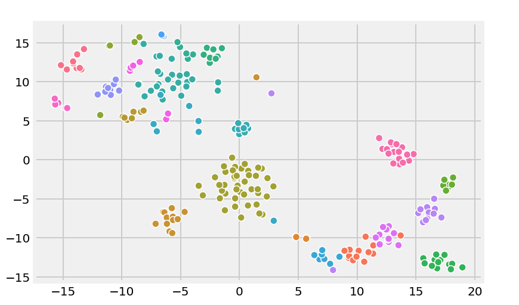

# Automated-Online-Proctor
An multi modal automated proctor for online exams 

### Results :
.
.

### References :
1) https://www.pyimagesearch.com/2017/05/08/drowsiness-detection-opencv/
2) https://github.com/yinguobing/head-pose-estimation
3) https://github.com/antoinelame/GazeTracking
4) https://www.learnopencv.com/head-pose-estimation-using-opencv-and-dlib/
5) https://github.com/jerryhouuu/Face-Yaw-Roll-Pitch-from-Pose-Estimation-using-OpenCV
6) https://github.com/krsatyam1996/Face-recognition-and-identification
7) https://github.com/cmusatyalab/openface
8) FaceNet: A Unified Embedding for Face Recognition and Clustering

#### Publications :
1. D. L. King and C. J. Case., “E-cheating: Incidence and trends among-college students.” inIssues in Information Systems, vol. 15, 2014.
2. D.  Varble,  “Reducing  cheating  opportunities  in  online  test,”AtlanticMarketing Journal, 09 2014.
3. E.  Flior  and  K.  Kowalski,  “Continuous  biometric  user  authenticationin  online  examinations,”  in2010  Seventh  International  Conference  onInformation Technology: New Generations, 2010, pp. 488–492.
4. M. McGinity, “Let your fingers do the talking,”Commun. ACM, vol. 48,pp. 21–23, 01 2005.  
5. A. Javed and Z. Aslam, “An intelligent alarm based visual eye trackingalgorithm for cheating free examination system,”International Journalof Intelligent Systems and Applications, vol. 5, pp. 86–92, 09 2013.
6. S. S. Chua, J. B. Bondad, Z. R. Lumapas, and J. D. L. Garcia, “Onlineexamination system with cheating prevention using question bank ran-domization  and  tab  locking,”  in 2019  4th  International  Conference  onInformation Technology (InCIT), 2019, pp. 126–131.
7. R.  Bawarith,  D.  Abdullah,  D.  Anas,  and  P.  Dr,  “E-exam  cheatingdetection system,”International Journal of Advanced Computer Scienceand Applications, vol. 8, 04 2017.
8. A. A. Sukmandhani and I. Sutedja, “Face recognition method for onlineexams,” in2019 International Conference on Information Managementand Technology (ICIMTech), vol. 1, 2019, pp. 175–179.
9. S.  Sawhney,  K.  Kacker,  S.  Jain,  S.  N.  Singh,  and  R.  Garg,  “Real-time  smart  attendance  system  using  face  recognition  techniques,”  in2019 9th International Conference on Cloud Computing, Data ScienceEngineering (Confluence), 2019, pp. 522–525.[10]  
10. Y. Atoum, L. Chen, A. X. Liu, S. D. H. Hsu, and X. Liu, “Automatedonline  exam  proctoring,”IEEE  Transactions  on  Multimedia,  vol.  19,no. 7, pp. 1609–1624, 2017.
11. Liu Siyao and Gong Qianrang, “The research on anti-cheating strategyof online examination system,” in2011 2nd International Conference onArtificial  Intelligence,  Management  Science  and  Electronic  Commerce(AIMSEC), 2011, pp. 1738–1741.
12. S. Prathish, A. N. S., and K. Bijlani, “An intelligent system for onlineexam  monitoring,”  in2016  International  Conference  on  InformationScience (ICIS), 2016, pp. 138–143.
13. G.  Kasliwal,  “Cheating  detection  in  online  examinations,”Master’sProject, 2015.
14. A.  Arinaldi  and  M.  I.  Fanany,  “Cheating  video  description  basedon  sequences  of  gestures,”  in2017  5th  International  Conference  onInformation and Communication Technology (ICoIC7), 2017, pp. 1–6.
15. H. Xia and C. Li, “Face recognition and application of film and televisionactors  based  on  dlib,”  in2019  12th  International  Congress  on  Imageand Signal Processing, BioMedical Engineering and Informatics (CISP-BMEI), 2019, pp. 1–6.
16. X.  Li,  K.-m.  Chang,  Y.  Yuan,  and  A.  Hauptmann,  “Massive  openonline  proctor:  Protecting  the  credibility  of  moocs  certificates,”  inProceedings  of  the  18th  ACM  Conference  on  Computer  SupportedCooperative  Work  &  Social  Computing,  ser.  CSCW  ’15.New  York,NY, USA: Association for Computing Machinery, 2015, p. 1129–1137.[Online]. Available: https://doi.org/10.1145/2675133.2675245
17. S. H ̈offner, “Gaze tracking using common webcams,” Ph.D. dissertation,02 2018.
18. A. Kar and P. Corcoran, “A review and analysis of eye-gaze estimationsystems,  algorithms  and  performance  evaluation  methods  in  consumerplatforms,”IEEE Access, vol. 5, pp. 16 495–16 519, 2017.
19. C.  Meng  and  X.  Zhao,  “Webcam-based  eye  movement  analysis  usingcnn,”IEEE Access, vol. 5, pp. 19 581–19 587, 2017.
20. A.  Papoutsaki,  P.  Sangkloy,  J.  Laskey,  N.  Daskalova,  J.  Huang,  andJ. Hays, “Webgazer: Scalable webcam eye tracking using user interac-tions,” inIJCAI, 2016.
21. T. Imabuchi, O. D. A. Prima, and H. Ito, “Visible spectrum eye trackingfor  safety  driving  assistance,”  inTrends  in  Applied  Knowledge-BasedSystems and Data Science, H. Fujita, M. Ali, A. Selamat, J. Sasaki, andM.  Kurematsu,  Eds.Cham:  Springer  International  Publishing,  2016,pp. 428–434.
22. B. Amos, B. Ludwiczuk, and M. Satyanarayanan, “Openface: A general-purpose face recognition library with mobile applications,” CMU-CS-16-118, CMU School of Computer Science, Tech. Rep., 2016.
23. The OpenCV Reference Manual, 2nd ed., Itseez, April 2014.
24. F.  Rocca,  M.  Mancas,  and  B.  Gosselin,  “Head  pose  estimation  byperspective-n-point  solution  based  on  2d  markerless  face  tracking,”inIntelligent  Technologies  for  Interactive  Entertainment,  D.  Reidsma,I. Choi, and R. Bargar, Eds.    Cham: Springer International Publishing,2014, pp. 67–76.
25. J. Daugman, “New methods in iris recognition,”IEEE Transactions onSystems, Man, and Cybernetics, Part B (Cybernetics), vol. 37, no. 5, pp.1167–1175, 2007.
26. B. K. Savas ̧ and Y. Becerikli, “Real time driver fatigue detection basedon  svm  algorithm,”  in2018  6th  International  Conference  on  ControlEngineering Information Technology (CEIT), 2018, pp. 1–4.
27. M. Ariz, J. Bengoechea, A. Villanueva, and R. Cabeza, “A novel 2d/3ddatabase  with  automatic  face  annotation  for  head  tracking  and  poseestimation,”Computer  Vision  and  Image  Understanding,  vol.  148,  pp.201–210, 07 2016.
28. A.  Villanueva,  V.  Ponz,  L.  Sesma-Sanchez,  M.  Ariz,  S.  Porta,  andR.  Cabeza,  “Hybrid  method  based  on  topography  for  robust  detectionof   iris   center   and   eye   corners,”ACM   Trans.   Multimedia   Comput.Commun.   Appl.,   vol.   9,   no.   4,   Aug.   2013.   [Online].   Available:https://doi.org/10.1145/2501643.2501647

